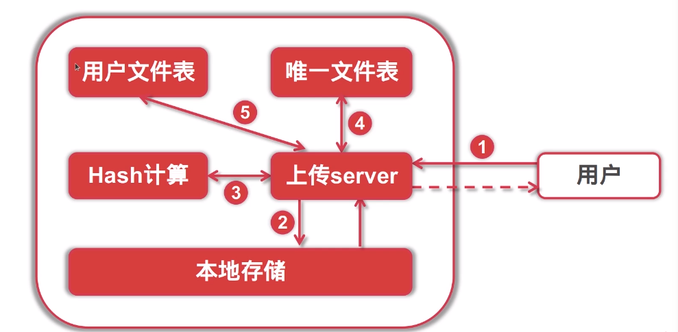

v1版本
===

### 接口列表
- 文件上传接口:POST /file/upload
- 文件查询接口:GET /file/query
- 文件下载接口:GET /file/:filename/download
- 文件删除接口:DELETE /file/:filename/delete
- 文件修改(从命名)接口:PUT /file/:filename/update

### 秒传功能实现


### 数据库设计

#### 文件表设计
``` 
CREATE TABLE `tbl_file`(
    `id` INT(11) NOT NULL AUTO_INCREMENT,
    `file_sha1` CHAR(40) NOT NULL DEFAULT '' COMMENT '文件hash',
    `file_size` BIGINT(20) DEFAULT 0 COMMENT '文件大小',
    `file_name` varchar(256) NOT NULL DEFAULT '' COMMENT '文件名',
    `file_addr` VARCHAR(1024) NOT NULL DEFAULT '' COMMENT '文件存储位置',
    `create_at` INT DEFAULT 0 COMMENT '创建日期',
    `update_at` INT DEFAULT 0 COMMENT '更新日期',
    `status` TINYINT NOT NULL DEFAULT 0 COMMENT '状态(0可用/1禁用/2已经删除)',
    `ext1` INT(11) DEFAULT 0 COMMENT '备用字段1',
    `ext2` TEXT COMMENT '备用字段2',
    PRIMARY KEY(`id`),
    UNIQUE KEY `file_sha1`(`file_sha1`),
    KEY `status`(`status`)
)ENGINE=InnoDB AUTO_INCREMENT=1 DEFAULT CHARSET=UTF8;
```

#### 用户表设计
``` 
CREATE TABLE `tbl_user`(
  `id` int(11) NOT NULL AUTO_INCREMENT,
  `user_name` varchar(64) NOT NULL DEFAULT '' COMMENT '用户名',
  `user_pwd` varchar(256) NOT NULL DEFAULT '' COMMENT '用户encoded密码',
  `email` varchar(64) DEFAULT '' COMMENT '邮箱',
  `phone` varchar(128) DEFAULT '' COMMENT '手机号',
  `email_validated` tinyint(1) DEFAULT 0 COMMENT '邮箱是否已验证',
  `phone_validated` tinyint(1) DEFAULT 0 COMMENT '手机号是否已验证',
  `signup_at` INT NOT NULL DEFAULT 0 COMMENT '注册日期',
  `last_active` INT NOT NULL DEFAULT 0 COMMENT '最后活跃时间戳',
  `profile` text COMMENT '用户属性',
  `status` int(11) NOT NULL DEFAULT 0 COMMENT '账户状态(启用/禁用/锁定/标记删除等)',
  PRIMARY KEY (`id`),
  UNIQUE KEY `idx_phone` (`phone`),
  KEY `idx_status` (`status`)
)ENGINE=InnoDB AUTO_INCREMENT=1 DEFAULT CHARSET=utf8;
```

#### ToKen表结构 这里的token有点不规范阿,见谅了
``` 
CREATE TABLE `tbl_user_token` (
  `id` int(11) NOT NULL AUTO_INCREMENT,
  `user_name` varchar(64) NOT NULL DEFAULT '' COMMENT '用户名',
  `user_token` char(40) NOT NULL DEFAULT '' COMMENT '用户登录token',
    PRIMARY KEY (`id`),
  UNIQUE KEY `idx_username` (`user_name`)
) ENGINE=InnoDB DEFAULT CHARSET=utf8mb4;
```