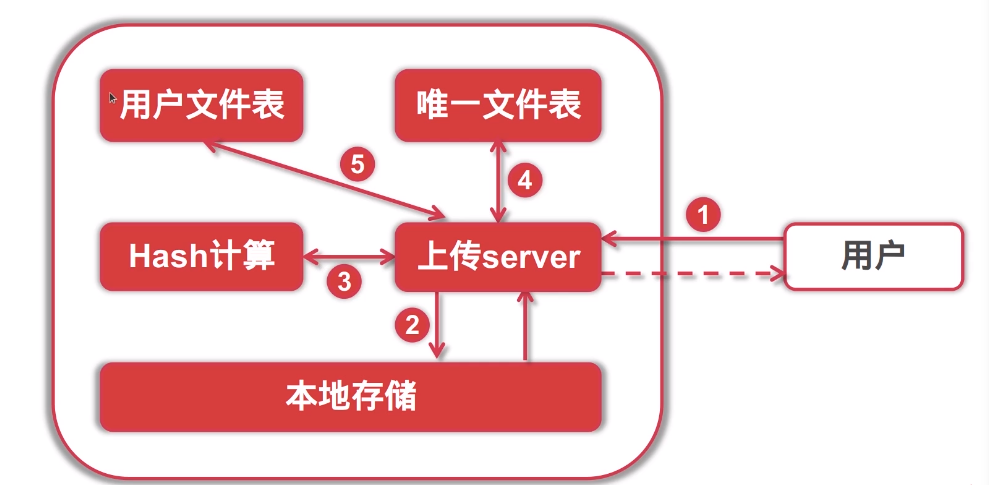
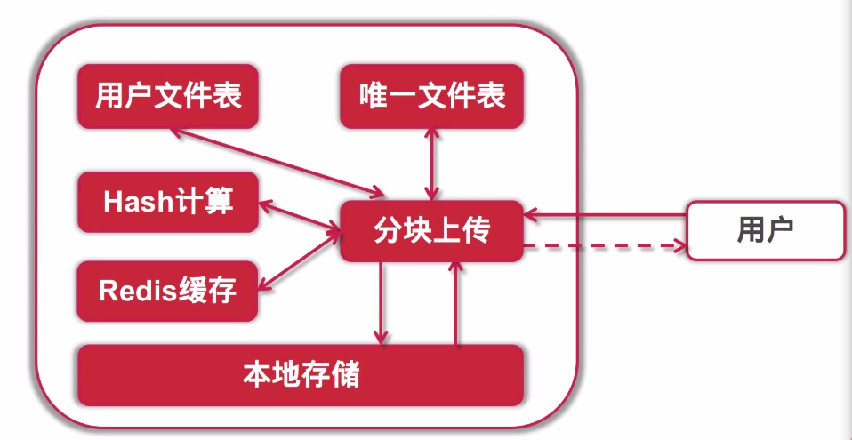

v2版本
===
- 实现秒传功能
- 实现文件分块上传
- 实现断点续传



### 数据库设计

#### 用户文件表设计
``` 
CREATE TABLE `tbl_user_file` (
  `id` int(11) NOT NULL PRIMARY KEY AUTO_INCREMENT,
  `user_name` varchar(64) NOT NULL,
  `file_sha1` varchar(64) NOT NULL DEFAULT '' COMMENT '文件hash',
  `file_size` bigint(20) DEFAULT 0 COMMENT '文件大小',
  `file_name` varchar(256) NOT NULL DEFAULT '' COMMENT '文件名',
  `upload_at` int DEFAULT 0 COMMENT '上传时间',
  `last_update` int DEFAULT 0 COMMENT '最后修改时间',
  `status` int(11) NOT NULL DEFAULT 0 COMMENT '文件状态(0正常1已删除2禁用)',
  UNIQUE KEY `idx_user_file` (`user_name`, `file_sha1`),
  KEY `idx_status` (`status`),
  KEY `idx_user_id` (`user_name`)
) ENGINE=InnoDB DEFAULT CHARSET=utf8mb4;
```

### 秒传业务具体实现逻辑
用户在客户端对文件的hash进行sha1计算上传文件携带hash
服务端向对hash在数据库中进行查询,如果存储着返回上传成功
反之接受文件

### 分块上传和断点续传
- 小文件不建议分块上传
- 可以并行上传分块,并且可以无序传输
- 分块上传极大提高传输效率
- 减少失败后重试的流量和时间
#### 分块上传
> 文件切分成多块,独立传输,上传完成后合并

步骤:
- 初始化上传 (前段上传初始化,提示后端文件切分为几块,每块多大)
- 上传分块(并行)  (客户端执行上传分块任务) (可以手动取消) (获取文件上传进度)
- 通知上传完成 (通知后端文件块全部上传完毕,可以执行合并)

服务器架构变迁
 
#### 断点续传
> 基于分块上传机制实现,传输暂停或者异常中断后,可以基于原来的进度重传

### 接口设计
``` 
	// 分块上传通用接口
	// 初始化分块信息
	router.POST("/file/mpupload/init",nil)
	// 上传分块
	router.POST("/file/mpupload/uppart",nil)
	// 通知分块上传完成
	router.POST("/file/mpupload/complete",nil)
	// 取消上传分块
	router.POST("/file/mpupload/cancel",nil)
	// 查看分块上传的整体状态
	router.POST("/file/mpupload/status",nil)
```

