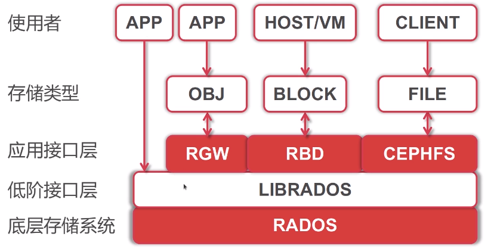
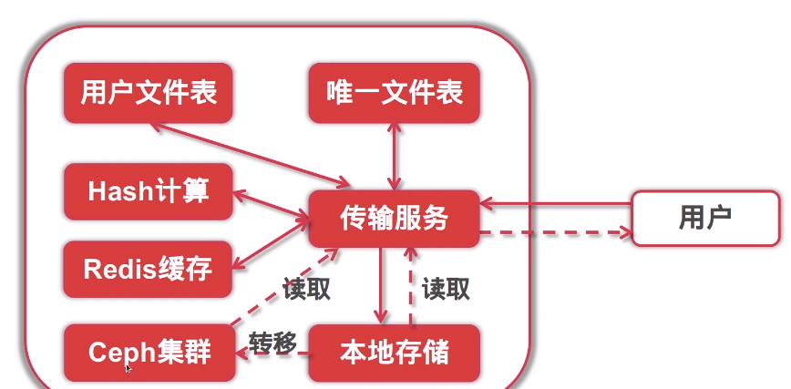

Ceph分布式存储
===
### 特点:
部署简单
可靠性高
性能高
分布式,可扩展性强
多语言
开源


### Ceph基础组建
- OSD:
    - 用于集群中所有数据与对象的存储:存储/复制/平衡/恢复数据等等
- Monitor:
    - 监控集群状态,维护cluster MAP表,保证集群数据一致性
- MDS:(可选)
    - 保持文件系统服务的元数据(OBJ.Block不需要该服务)
- GW:
    - 提供与AmazonS3和Swift兼容的RESTful API的gateway服务
    
### AWS S3 术语
- Region: 存储数据所在的地理区域
- Endpoint: 存储服务入口,Web服务入口点URL
- Bucket: 存储桶S3中用于存储对象的容器
- Object: 对象是S3中存储的基本实体,由对象数据和元数据组成
- Key: key是存储桶的唯一标识符,桶内的每个对象都只能有一个key

### 服务器架构变迁


### Go管理Ceph集群
依赖
``` 
vgo get gopkg.in/amz.v1/aws
vgo get gopkg.in/amz.v1/s3
```
``` 
package ceph

import (
	"gopkg.in/amz.v1/aws"
	"gopkg.in/amz.v1/s3"
)

var (
	CephConn *s3.S3
)

func init() {
	// 初始化ceph信息
	auth := aws.Auth{
		AccessKey: "",
		SecretKey: "",
	}
	region := aws.Region{
		Name:"default",
		EC2Endpoint:"http://127.0.0.1:9080",
		S3Endpoint:"http://127.0.0.1:9080",
		S3BucketEndpoint:"",
		S3LocationConstraint:false, // 没有区域限制
		S3LowercaseBucket:false, // bucket没有大小写限制
		Sign:aws.SignV2,
	}
	// 创建🔓s3类型连接
	CephConn = s3.New(auth, region)
}

// 获取指定Bucker
func GetCephBucker(bucket string)*s3.Bucket {
	return CephConn.Bucket(bucket)
}
```

### ceph小结
- 创建bucket
``` 
	bucker := ceph.GetCephBucker("testbucket1")
	// 创建一个新的bucket
	err := bucker.PutBucket(s3.PublicRead) // 参数权限
```
- 上传文件
``` 
	filename := "test.txt"
	bucker := ceph.GetCephBucker("userfile")
	cephPath := "/ceph/" + filename
	bytes, _ := ioutil.ReadFile(filename)
	bucker.Put(cephPath,bytes,"octet-stream",s3.PublicRead)
```
- 下载文件
``` 
bucker := ceph.GetCephBucker("userfile")
cephPath := "/ceph/test.txt"
data, _ := bucker.Get(cephPath)
ioutil.WriteFile("hello.text",data,00666)
```