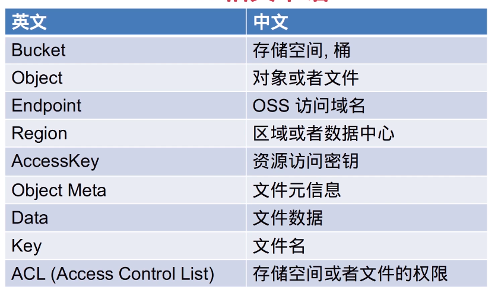

v4版本
===

### OSS特点
- 可靠性 服务可用性,数据持久性
- 安全性 资源隔离存储,访问鉴权
- 易用性 标准RESTful风格API,多语言SDK接入
- 处理能力 海量规模,图片处理,音视频转码...

### 专业术语


``` 
type OssCon struct {
	OssBucket string `json:"oss_bucket"`
	OssEndpoint string `json:"oss_endpoint"`
	// oss访问key
	OssAccessKeyID string `json:"oss_access_key_id"`
	// oss访问key secret
	OssAccessKeySecret string `json:"oss_access_key_secret"`
}
```

这里就用sdk演示吧(but我非常不喜欢sdk)
`vgo get github.com/aliyun/aliyun-oss-go-sdk/oss`